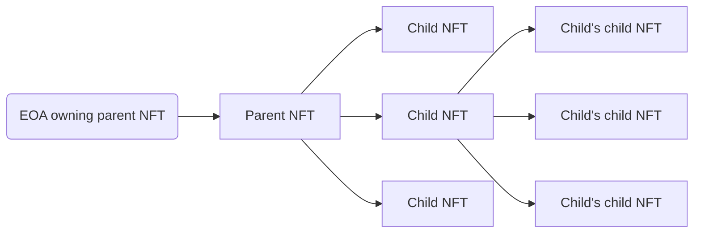

# RMRK ERCs

In an effort to improve NFTs for everyone, we published our legos and some extensions as Ethereum Request for Comments (ERCs).

## ERC-5773: Context-Dependent Multi-Asset Tokens

This ERC is the standardized implementation of the MultiAsset RMRK lego.

The Multi-Asset NFT standard allows for the construction of a new primitive: context-dependent output of information per single NFT.

The context-dependent output of information means that the asset in an appropriate format is displayed based on how the token is being accessed. I.e., if the token is being opened in an e-book reader, the PDF asset is displayed; if the token is opened in the marketplace, the PNG or the SVG asset is displayed; if the token is accessed from within a game, the 3D model asset is accessed, and if the token is accessed by the (Internet of Things) IoT hub, the asset providing the necessary addressing and specification information is accessed.

An NFT can have multiple assets (outputs), which can be any kind of file to be served to the consumer, and orders them by priority. They do not have to match in mime-type or `tokenURI`, nor do they depend on one another. Assets are not standalone entities but should be thought of as “namespaced token URIs” that can be ordered at will by the NFT owner but only modified, updated, added, or removed if agreed on by both the owner of the token and the issuer of the token.


ERC-5773: Context-Dependent Multi-Asset Tokens


## ERC-7401: Parent-Governed Non-Fungible Tokens Nesting

This ERC is the standardized implementation of Nestable RMRK lego.

The Parent-Governed Nestable NFT standard extends [ERC-721](https://eips.ethereum.org/EIPS/eip-721) by allowing for a new inter-NFT relationship and interaction.

At its core, the idea behind the proposal is simple: the owner of an NFT does not have to be an Externally Owned Account (EOA) or a smart contract; it can also be an NFT.

The process of nesting an NFT into another is functionally identical to sending it to another user. The process of sending a token out of another one involves issuing a transaction from the account owning the parent token.

An NFT can be owned by a single other NFT but can, in turn, have a number of NFTs that it owns. This proposal establishes the framework for the parent-child relationships of NFTs. A parent token is the one that owns another token. A child token is a token that is owned by another token. A token can be both a parent and a child at the same time. Child tokens of a given token can be fully managed by the parent token’s owner but can be proposed by anyone.

The graph illustrates how a child token can also be a parent token, but both are still administered by the root parent token’s owner.


ERC-7401: Parent-Governed Non-Fungible Tokens Nesting


## ERC-6220: Composable NFTs utilizing Equippable Parts

This ERC is the standardized implementation of Equippable RMRK lego.

The Composable NFTs utilizing equippable parts standard extends [ERC-721](https://eips.ethereum.org/EIPS/eip-721) by allowing the NFTs to selectively add parts to themselves via equipping.

Tokens can be composed by cherry-picking the list of parts from a Catalog for each NFT instance and are able to equip other NFTs into slots, which are also defined within the Catalog. Catalogs contain parts from which NFTs can be composed.

This proposal introduces two types of parts; slot type of parts and fixed type of parts. The slot type of parts allow for other NFT collections to be equipped into them, while fixed parts are full components with their own metadata.

Equipping a part into an NFT doesn’t generate a new token but rather adds another component to be rendered when retrieving the token.


ERC-6220: Composable NFTs utilizing Equippable Parts



There are two important terms when talking about ERC-6220: **composing** and **equipping**.\
\
**Composing** refers to the composition of a token using fixed parts. This allows tokens to be built from multiple pre-defined fixed parts from a catalog.\
\
**Equipping** refers to the augmentation of the token using slot parts. This allows for the modification of tokens by equipping child tokens into the slot parts from the catalog.


## ERC-6381: Public Non-Fungible Token Emote Repository

This ERC is the standardized implementation of Emotes RMRK extension.

The Public Non-Fungible Token Emote Repository standard provides an enhanced interactive utility for ERC-721 and ERC-1155 by allowing NFTs to be emoted at.

This proposal introduces the ability to react to NFTs using Unicode standardized emoji in a public non-gated repository smart contract that is accessible at the same address in all of the networks.


ERC-6381: Public Non-Fungible Token Emote Repository


## ERC-6454: Minimal Transferable NFT detection interface

This ERC is the standardized implementation of the Soulbound RMRK extension.

The Minimalistic Transferable interface for Non-Fungible Tokens standard extends [ERC-721](https://eips.ethereum.org/EIPS/eip-721) by introducing the ability to identify whether an NFT can be transferred or not.

This proposal introduces the ability to prevent a token from being transferred from their owner, making them bound to the externally owned account, abstracted account, smart contract, or token that owns it.


ERC-6454: Minimalistic Non-Transferable NFTs


## ERC-7508: Dynamic On-Chain Token Attributes Repository

This ERC standardizes on-cain storage, retrieval, and management of token attributes.

The Public On-Chain Non-Fungible Token Attributes Repository standard provides the ability for [ERC-721](https://eips.ethereum.org/EIPS/eip-721) and [ERC-1155](https://eips.ethereum.org/EIPS/eip-1155) compatible tokens to store their attributes on-chain available to any external smart contract interacting with them.

This proposal introduces the ability to assign attributes to NFTs in a public non-gated repository smart contract that is accessible at the same address in all of the networks. The repository smart contract is designed to be a common-good repository, meaning that it can be used by any ERC-721 or ERC-1155 compatible token.


ERC-7508: Dynamic On-Chain Token Attributes Repository

