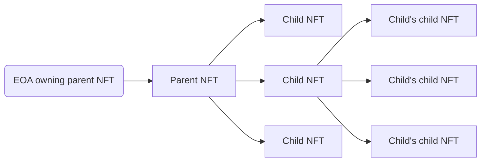
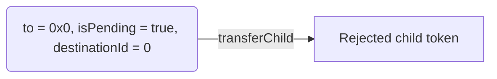
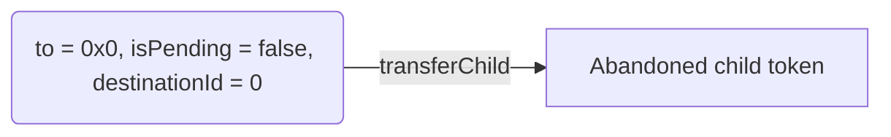
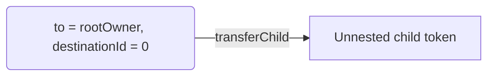
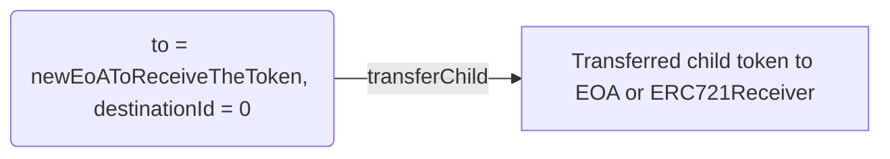
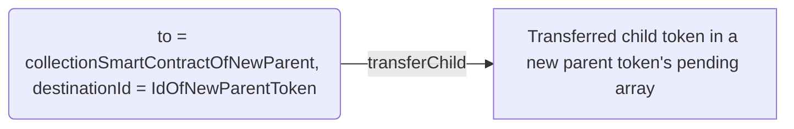

# Nestable (ERC-7401)

The Nestable RMRK lego allows for a new inter-NFT relationship and interaction.

At its core, the idea behind the lego is simple: the owner of an NFT does not have to be an Externally Owned Account (EOA) or a smart contract, it can also be an NFT.

The process of nesting an NFT into another is functionally identical to sending it to another user. The process of sending a token out of another one involves issuing a transaction from the account owning the parent token.

An NFT can be owned by a single other NFT, but can in turn have a number of NFTs that it owns. This lego provides the framework for the parent-child relationships of NFTs. A parent token is the one that owns another token. A child token is the token that is owned by another token. A token can be both a parent and child at the same time. Child tokens of a given tokens can be fully managed by the parent token's owner, but can be proposed by anyone.



The graph illustrates how a child token can also be a parent token, but both are still administered by the root parent token's owner.

## ERC-7401: Parent-Governed Non-Fungible Tokens Nesting

We published an Ethereum Improvement Proposal detailing the specification of the Nestable RMRK lego. If you are interested, you can access it here:


ERC-7401: Parent-Governed Non-Fungible Tokens Nesting


## Managing child NFTs

To fully understand all of the available actions the parent token can take concerning the child token, the `transferChild` function should be examined. The following state transitions of a child token are available with it:

1. Reject child token
2. Abandon child token
3. Unnest child token
4. Transfer the child token to an EOA or an `ERC721Receiver`
5. Transfer the child token into a new parent token

To better understand how these state transitions are achieved, we have to look at the available parameters passed to `transferChild`:

```solidity
    function transferChild(
        uint256 tokenId,
        address to,
        uint256 destinationId,
        uint256 childIndex,
        address childAddress,
        uint256 childId,
        bool isPending,
        bytes data
    ) external;
```

Based on the desired state transitions, the values of these parameters have to be set accordingly (any parameters not set in the following examples depend on the child token being managed):

### **Reject child token**



### **Abandon child token**



### **Unnest child token**



### **Transfer the child token to an EOA or an `ERC721Receiver`**



### **Transfer the child token into a new parent token**



This state change places the token in the pending array of the new parent token. The child token still needs to be accepted by the new parent token's root owner in order to be placed into the active array of that token.
