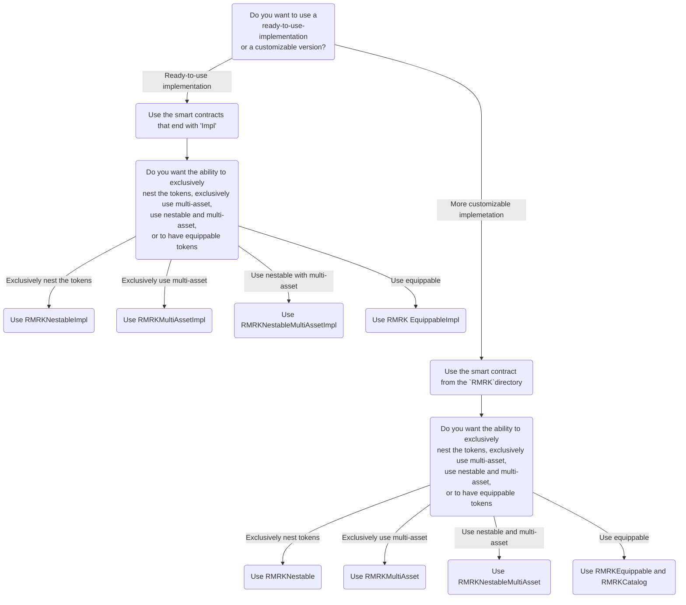

# Which lego to use?

## How to decide which lego to use?

The decision on which RMRK lego implementation to use can be daunting as there is a lot to pick from, but the following questions might help. Additionally, you can refer to the [decision flowchart](which-lego-to-use.md#flowchart).

We provide minimal implementations of our standards as well as ready-to-use implementations. The former allow for more business logic customization but also require custom core logic implementation. The latter provide fully usable smart contracts that require little to no modifications but have less space for customization.

If you require minimal implementation in order to implement more custom business logic, you can refer to the [Minimal Implementation](which-lego-to-use.md#minimal-implementation) section.

If you require the ready-to-use implementation, you can refer to the [Ready-to-use Implementation](which-lego-to-use.md#ready-to-use-implementation) section.

### Minimal Implementation

There is a number of available minimal implementation smart contracts available:

#### RMRKNestable

`RMRKNestable` provides the minimal implementation of RMRK nestable lego, also known as [ERC-6059](https://eips.ethereum.org/EIPS/eip-6059). It allows the nesting of NFTs into one another.

* You can refer to the `RMRKNestable` documentation [here](../evm-contracts-documentation/rmrk/nestable/rmrknestable.md)
* You can refer to the `RMRKNestable` source code [here](https://github.com/rmrk-team/evm/blob/master/contracts/RMRK/nestable/RMRKNestable.sol)

In order to import the RMRKNestable into your smart contract, you can import it from `@rmrk-team/evm-contracts`:

```solidity
import "@rmrk-team/evm-contracts/contracts/RMRK/nestable/RMRKNestable.sol";
```

#### RMRKMultiAsset

`RMRKMultiAsset` provides the minimal implementation of RMRK multi-asset lego, also known as [ERC-5773](https://eips.ethereum.org/EIPS/eip-5773). It allows a single token to have multiple assets.

* You can refer to the `RMRKMultiAsset` documentation [here](../evm-contracts-documentation/rmrk/multiasset/rmrkmultiasset.md)
* You can refer to the `RMRKMultiAsset` source code [here](https://github.com/rmrk-team/evm/blob/master/contracts/RMRK/multiasset/RMRKMultiAsset.sol)q

In order to import the `RMRKMultiAsset` into your smart contract, you can import it from `@rmrk-team/evm-contracts`:

```solidity
import "@rmrk-team/evm-contracts/contracts/RMRK/multiasset/RMRKMultiAsset.sol";
```

#### RMRKNestableMultiAsset

`RMRKNestableMultiAsset` provides the minimal implementation of joined RMRK nestable and multi-asset legos, also known as [ERC-6059](https://eips.ethereum.org/EIPS/eip-6059) and [ERC-5773](https://eips.ethereum.org/EIPS/eip-5773). It allows tokens to be nested into one another and every single token to have multiple assets.

* You can refer to the `RMRKNestableMultiAsset` documentation [here](../evm-contracts-documentation/rmrk/nestable/rmrknestablemultiasset.md)
* You can refer to the `RMRKNestableMultiAsset` source code [here](https://github.com/rmrk-team/evm/blob/master/contracts/RMRK/nestable/RMRKNestableMultiAsset.sol)

In order to import the `RMRKNestableMultiAsset` into your smart contract, you can import it from `@rmrk-team/evm-contracts`:

```solidity
import "@rmrk-team/evm-contracts/contracts/RMRK/nestable/RMRKNestableMultiAsset.sol";
```

#### RMRKEquippable


The `RMRKEquippable` is considered the merged equippable RMRK lego composite as it uses two smart contracts (Equippable and Core) to provide the full Equippable capabilities. This means that there are fewer smart contracts to manage, but there is also very little space for customization.


`RMRKEquippable` provides the minimal implementation of RMRK equippable lego, also known as ERC-6220. It allows tokens to be equipped into other tokens. In addition to the Equippable smart contract, you also need to set up the RMRK catalog lego.

* You can refer to the `RMRKEquippable` documentation [here](../evm-contracts-documentation/rmrk/equippable/rmrkequippable.md)
* You can refer to the `RMRKEquippable` source code [here](https://github.com/rmrk-team/evm/blob/master/contracts/RMRK/equippable/RMRKEquippable.sol)

In order to import the `RMRKEquippable` into your smart contract, you can import it from `@rmrk-team/evm-contracts`:

```solidity
import "@rmrk-team/evm-contracts/contracts/RMRK/equippable/RMRKEquippable.sol";
```

* You can refer to the `RMRKCatalog` documentation [here](../evm-contracts-documentation/rmrk/catalog/rmrkcatalog.md)
* You can refer to the `RMRKCatalog` source code [here](https://github.com/rmrk-team/evm/blob/master/contracts/RMRK/catalog/RMRKCatalog.sol)

In order to import the RMRKCatalog into your smart contract, you can import it from `@rmrk-team/evm-contracts`:

```solidity
import "@rmrk-team/evm-contracts/contracts/RMRK/catalog/RMRKCatalog.sol";
```

#### RMRKMinifiedEquippable


The `RMRKMinifiedEquippable` is considered the merged equippable RMRK lego composite as it uses two smart contracts (minified Equippable and Core) to provide the full Equippable capabilities. This means that there are fewer smart contracts to manage, but there is also not a lot of space for customization. However, the minified Equippable has more space for customization than `RMRKEquippable` since the redundant inherited functions have been manually removed.


`RMRKMinifiedEquippable` provides the minimal implementation of RMRK equippable lego composite, also known as ERC-6220. It allows tokens to be equipped into other tokens. In addition to the Equippable smart contract, you also need to set up the RMRK catalog lego.

* You can refer to the `RMRKMinifiedEquippable` documentation [here](../evm-contracts-documentation/rmrk/equippable/rmrkminifiedequippable.md)
* You can refer to the `RMRKMinifiedEquippable` source code [here](https://github.com/rmrk-team/evm/blob/master/contracts/RMRK/equippable/RMRKMinifiedEquippable.sol)

In order to import the `RMRKMinifiedEquippable` into your smart contract, you can import it from `@rmrk-team/evm-contracts`:

```solidity
import "@rmrk-team/evm-contracts/contracts/RMRK/equippable/RMRKMinifiedEquippable.sol";
```

* You can refer to the `RMRKCatalog` documentation [here](../evm-contracts-documentation/rmrk/catalog/rmrkcatalog.md)
* You can refer to the `RMRKCatalog` source code [here](https://github.com/rmrk-team/evm/blob/master/contracts/RMRK/catalog/RMRKCatalog.sol)

In order to import the RMRKCatalog into your smart contract, you can import it from `@rmrk-team/evm-contracts`:

```solidity
import "@rmrk-team/evm-contracts/contracts/RMRK/catalog/RMRKCatalog.sol";
```

#### RMRKExternalEquip & RMRKNestableExternalEquip


The `RMRKExternalEquip` and `RMRKNestableExternalEquip` are considered the split equippable RMRK lego composite as it uses three smart contracts (External Equippable, Nestable External Equippable and Core) to provide the full Equippable capabilities. This means that there are more smart contracts to manage, but there is also more space for customization.


`RMRKExternalEquip` provides the equipping part of the implementation of RMRK equippable lego composite, also known as ERC-6220. It allows tokens to be equipped into other tokens. In addition to the External Equippable smart contract, you also need to set up the Nestable External Equip and RMRK catalog lego.

* You can refer to the `RMRKExternalEquip` documentation [here](../evm-contracts-documentation/rmrk/equippable/rmrkexternalequip.md)
* You can refer to the `RMRKExternalEquip` source code [here](https://github.com/rmrk-team/evm/blob/master/contracts/RMRK/equippable/RMRKExternalEquip.sol)

In order to import the `RMRKMinifiedEquippable` into your smart contract, you can import it from `@rmrk-team/evm-contracts`:

```solidity
import "@rmrk-team/evm-contracts/contracts/RMRK/equippable/RMRKExternalEquip.sol";
```

`RMRKNestableExternalEquip` provides the nesting part of the implementation of RMRK equippable lego composite, also known as ERC-6220. It allows tokens to be nested into other tokens to be equipped.

* You can refer to the `RMRKNestableExternalEquip` documentation [here](../evm-contracts-documentation/rmrk/equippable/rmrknestableexternalequip.md)
* You can refer to the `RMRKNestableExternalEquip` source code [here](https://github.com/rmrk-team/evm/blob/master/contracts/RMRK/equippable/IRMRKNestableExternalEquip.sol)

```solidity
import "@rmrk-team/evm-contracts/contracts/RMRK/equippable/RMRKNestablelolExternalEquip.sol";
```

* You can refer to the `RMRKCatalog` documentation [here](../evm-contracts-documentation/rmrk/catalog/rmrkcatalog.md)
* You can refer to the `RMRKCatalog` source code [here](https://github.com/rmrk-team/evm/blob/master/contracts/RMRK/catalog/RMRKCatalog.sol)

In order to import the `RMRKMinifiedEquippable` into your smart contract, you can import it from `@rmrk-team/evm-contracts`:

```solidity
import "@rmrk-team/evm-contracts/contracts/RMRK/equippable/RMRKExternalEquip.sol";
```

In order to import the RMRKCatalog into your smart contract, you can import it from `@rmrk-team/evm-contracts`:

```solidity
import "@rmrk-team/evm-contracts/contracts/RMRK/catalog/RMRKCatalog.sol";
```

### Ready-to-use Implementation

There is a number of ready-to-use implementation smart contracts available. Each of the implementations also has three variations:

* The native token pay implementations are designed around minting being paid by the native token of the chain to which the smart contract is deployed.
* The ERC-20 pay implementations are designed to support paying for token minting using ERC-20 tokens.
* The premint implementations are designed for minting to be done by the issuer and distributed later.

#### Nestable

The `RMRKNestableImpl` provides a ready-to-use native token pay implementation of RMRK nestable lego, also known as the [ERC-6059](https://eips.ethereum.org/EIPS/eip-6059) allowing NFTs to be nested into other NFTs.

* You can refer to the `RMRKNestableImpl` documentation [here](../evm-contracts-documentation/implementations/native-token-pay/rmrknestableimpl.md)
* You can refer to the `RMRKNestableImpl` source code [here](https://github.com/rmrk-team/evm/blob/master/contracts/implementations/nativeTokenPay/RMRKNestableImpl.sol)

In order to import the `RMRKNestableImpl` into your smart contract, you can import it from `@rmrk-team/evm-contracts`:

```solidity
import "@rmrk-team/evm-contracts/contracts/implementations/nativeTokenPay/RMRKNestableImpl.sol";
```

The `RMRKNestableImplErc20Pay` provides a ready-to-use ERC-20 pay implementation of RMRK nestable lego, also known as the [ERC-6059](https://eips.ethereum.org/EIPS/eip-6059) allowing NFTs to be nested into other NFTs.

* You can refer to the `RMRKNestableImplErc20Pay` documentation [here](../evm-contracts-documentation/implementations/erc-20-pay/rmrknestableimplerc20pay.md)
* You can refer to the `RMRKNestableImplErc20Pay` source code [here](https://github.com/rmrk-team/evm/blob/master/contracts/implementations/erc20Pay/RMRKNestableImplErc20Pay.sol)

In order to import the `RMRKNestableImplErc20Pay` into your smart contract, you can import it from `@rmrk-team/evm-contracts`:

```solidity
import "@rmrk-team/evm-contracts/contracts/implementations/erc20pay/RMRKNestableImplErc20Pay.sol";
```

The `RMRKNestableImplPreMint` provides a ready-to-use premint implementation of RMRK nestable lego, also known as the [ERC-6059](https://eips.ethereum.org/EIPS/eip-6059) allowing NFTs to be nested into other NFTs.

* You can refer to the `RMRKNestableImplPreMint` documentation [here](../evm-contracts-documentation/implementations/premint/rmrknestableimplpremint.md)
* You can refer to the `RMRKNestableImplPreMint` source code [here](https://github.com/rmrk-team/evm/blob/master/contracts/implementations/premint/RMRKNestableImplPreMint.sol)

In order to import the `RMRKNestableImplPreMint` into your smart contract, you can import it from `@rmrk-team/evm-contracts`:

```solidity
import "@rmrk-team/evm-contracts/contracts/implementations/premint/RMRKNestableImplPreMint.sol";
```

#### MultiAsset

The `RMRKMultiAssetImpl` provides a ready-to-use native token pay implementation of RMRK multi-asset lego, also known as the [ERC-5773](https://eips.ethereum.org/EIPS/eip-5773) allowing NFTs to have multiple assets.

* You can refer to the `RMRKMultiAssetImpl` documentation [here](../evm-contracts-documentation/implementations/native-token-pay/rmrkmultiassetimpl.md)
* You can refer to the `RMRKMultiAssetImpl` source code [here](https://github.com/rmrk-team/evm/blob/master/contracts/implementations/nativeTokenPay/RMRKMultiAssetImpl.sol)

In order to import the `RMRKMultiAssetImpl` into your smart contract, you can import it from `@rmrk-team/evm-contracts`:

```solidity
import "@rmrk-team/evm-contracts/contracts/implementations/nativeTokenPay/RMRKMultiAssetImpl.sol";
```

The `RMRKMultiAssetImplErc20Pay` provides a ready-to-use ERC-20 pay implementation of RMRK multi-asset lego, also known as the [ERC-5773](https://eips.ethereum.org/EIPS/eip-5773) allowing NFTs to have multiple assets.

* You can refer to the `RMRKMultiAssetImplErc20Pay` documentation [here](../evm-contracts-documentation/implementations/erc-20-pay/rmrkmultiassetimplerc20pay.md)
* You can refer to the `RMRKMultiAssetImplErc20Pay` source code [here](https://github.com/rmrk-team/evm/blob/master/contracts/implementations/erc20Pay/RMRKMultiAssetImplErc20Pay.sol)

In order to import the `RMRKMultiAssetImplErc20Pay` into your smart contract, you can import it from `@rmrk-team/evm-contracts`:

```solidity
import "@rmrk-team/evm-contracts/contracts/implementations/erc20pay/RMRKMultiAssetImplErc20Pay.sol";
```

The `RMRKMultiAssetImplPreMint` provides a ready-to-use premint implementation of RMRK multi-asset lego, also known as the [ERC-5773](https://eips.ethereum.org/EIPS/eip-5773) allowing NFTs to have multiple assets.

* You can refer to the `RMRKMultiAssetImplPreMint` documentation [here](../evm-contracts-documentation/implementations/premint/rmrkmultiassetimplpremint.md)
* You can refer to the `RMRKMultiAssetImplPreMint` source code [here](https://github.com/rmrk-team/evm/blob/master/contracts/implementations/premint/RMRKMultiAssetImplPreMint.sol)

In order to import the `RMRKMultiAssetImplPreMint` into your smart contract, you can import it from `@rmrk-team/evm-contracts`:

```solidity
import "@rmrk-team/evm-contracts/contracts/implementations/premint/RMRKMultiAssetImplPreMint.sol";
```

#### Nestable with MultiAsset

The `RMRKNestableMultiAssetImpl` provides a ready-to-use native token pay implementation of RMRK nestable and multi-asset legos, also known as the [ERC-6059](https://eips.ethereum.org/EIPS/eip-6059) and [ERC-5773](https://eips.ethereum.org/EIPS/eip-5773) allowing NFTs to be nested into after other NFTs and to have multiple assets.

* You can refer to the `RMRKNestableMultiAssetImpl` documentation [here](../evm-contracts-documentation/implementations/native-token-pay/rmrknestablemultiassetimpl.md)
* You can refer to the `RMRKNestableMultiAssetImpl` source code [here](https://github.com/rmrk-team/evm/blob/master/contracts/implementations/nativeTokenPay/RMRKNestableMultiAssetImpl.sol)

In order to import the `RMRKNestableMultiAssetImpl` into your smart contract, you can import it from `@rmrk-team/evm-contracts`:

```solidity
import "@rmrk-team/evm-contracts/contracts/implementations/nativeTokenPay/RMRKNestableMultiAssetImpl.sol";
```

The `RMRKNestableMultiAssetImplErc20Pay` provides a ready-to-use ERC-20 pay implementation of RMRK nestable and multi-asset legos, also known as the [ERC-6059](https://eips.ethereum.org/EIPS/eip-6059) and [ERC-5773](https://eips.ethereum.org/EIPS/eip-5773) allowing NFTs to be nested into after other NFTs and to have multiple assets.

* You can refer to the `RMRKNestableMultiAssetImplErc20Pay` documentation [here](../evm-contracts-documentation/implementations/erc-20-pay/rmrknestablemultiassetimplerc20pay.md)
* You can refer to the `RMRKNestableMultiAssetImplErc20Pay` source code [here](https://github.com/rmrk-team/evm/blob/master/contracts/implementations/erc20Pay/RMRKNestableMultiAssetImplErc20Pay.sol)

In order to import the `RMRKNestableMultiAssetImplErc20Pay` into your smart contract, you can import it from `@rmrk-team/evm-contracts`:

```solidity
import "@rmrk-team/evm-contracts/contracts/implementations/erc20pay/RMRKNestableMultiAssetImplErc20Pay.sol";
```

The `RMRKNestableMultiAssetImplPreMint` provides a ready-to-use premint implementation of RMRK nestable and multi-asset legos, also known as the [ERC-6059](https://eips.ethereum.org/EIPS/eip-6059) and [ERC-5773](https://eips.ethereum.org/EIPS/eip-5773) allowing NFTs to be nested into after other NFTs and to have multiple assets.

* You can refer to the `RMRKNestableMultiAssetImplPreMint` documentation [here](../evm-contracts-documentation/implementations/premint/rmrknestablemultiassetimplpremint.md)
* You can refer to the `RMRKNestableMultiAssetImplPreMint` source code [here](https://github.com/rmrk-team/evm/blob/master/contracts/implementations/premint/RMRKNestableMultiAssetImplPreMint.sol)

In order to import the `RMRKNestableMultiAssetImplPreMint` into your smart contract, you can import it from `@rmrk-team/evm-contracts`:

```solidity
import "@rmrk-team/evm-contracts/contracts/implementations/premint/RMRKNestableMultiAssetImplPreMint.sol";
```

#### Merged equippable

The `RMRKEquippableImpl` provides a ready-to-use native token pay implementation of RMRK equippable lego, also known as the [ERC-6220](https://eips.ethereum.org/EIPS/eip-6220) allowing NFTs to be equipped into other NFTs.

* You can refer to the `RMRKEquippableImpl` documentation [here](../evm-contracts-documentation/implementations/native-token-pay/rmrkequippableimpl.md)
* You can refer to the `RMRKEquippableImpl` source code [here](https://github.com/rmrk-team/evm/blob/master/contracts/implementations/nativeTokenPay/RMRKEquippableImpl.sol)

In order to import the `RMRKEquippableImpl` into your smart contract, you can import it from `@rmrk-team/evm-contracts`:

```solidity
import "@rmrk-team/evm-contracts/contracts/implementations/nativeTokenPay/RMRKEqippableImpl.sol";
```

The `RMRKNestableImplErc20Pay` provides a ready-to-use ERC-20 pay implementation of RMRK equippable lego, also known as the [ERC-6220](https://eips.ethereum.org/EIPS/eip-6220) allowing NFTs to be equipped into other NFTs.

* You can refer to the `RMRKEquippableImplErc20Pay` documentation [here](../evm-contracts-documentation/implementations/erc-20-pay/rmrkequippableimplerc20pay.md)
* You can refer to the `RMRKEquippableImplErc20Pay` source code [here](https://github.com/rmrk-team/evm/blob/master/contracts/implementations/erc20Pay/RMRKEquippableImplErc20Pay.sol)

In order to import the `RMRKEquippableImplErc20Pay` into your smart contract, you can import it from `@rmrk-team/evm-contracts`:

```solidity
import "@rmrk-team/evm-contracts/contracts/implementations/erc20pay/RMRKEquippableImplErc20Pay.sol";
```

The `RMRKEquippableImplPreMint` provides a ready-to-use premint implementation of RMRK equippable lego, also known as the [ERC-6220](https://eips.ethereum.org/EIPS/eip-6220) allowing NFTs to be equipped into other NFTs.

* You can refer to the `RMRKEquippableImplPreMint` documentation [here](../evm-contracts-documentation/implementations/premint/rmrkequippableimplpremint.md)
* You can refer to the `RMRKEquippableImplPreMint` source code [here](https://github.com/rmrk-team/evm/blob/master/contracts/implementations/premint/RMRKEquippableImplPreMint.sol)

In order to import the `RMRKEquippableImplPreMint` into your smart contract, you can import it from `@rmrk-team/evm-contracts`:

```solidity
import "@rmrk-team/evm-contracts/contracts/implementations/premint/RMRKEquippableImplPreMint.sol";
```


Please remember that any implementation of Equippable lego requires Catalog as well.


* You can refer to the `RMRKCatalogImpl` documentation [here](../evm-contracts-documentation/implementations/rmrkcatalogimpl.md)
* You can refer to the `RMRKCatalogImpl` source code [here](https://github.com/rmrk-team/evm/blob/master/contracts/implementations/RMRKCatalogImpl.sol)

In order to import the `RMRKCatalogImpl` into your smart contract, you can import it from `@rmrk-team/evm-contracts`:

```solidity
import "@rmrk-team/evm-contracts/contracts/implementations/RMRKCatalogImpl.sol";l
```

#### Split equippable

The `RMRKExternalEquipImpl` and `RMRKNestableExternalEquipImpl` provide a ready-to-use native token pay implementation of RMRK equippable lego, also known as the [ERC-6220](https://eips.ethereum.org/EIPS/eip-6220) allowing NFTs to be equipped into other NFTs.

* You can refer to the `RMRKExternalEquipImpl` documentation [here](../evm-contracts-documentation/implementations/native-token-pay/rmrkexternalequipimpl.md)
* You can refer to the `RMRKExternalEquipImpl` source code [here](https://github.com/rmrk-team/evm/blob/master/contracts/implementations/nativeTokenPay/RMRKExternalEquipImpl.sol)
* You can refer to the `RMRKNestableExternalEquipImpl` documentation [here](../evm-contracts-documentation/implementations/native-token-pay/rmrknestableexternalequipimpl.md)
* You can refer to the `RMRKNestableExternalEquipImpl` source code [here](https://github.com/rmrk-team/evm/blob/master/contracts/implementations/nativeTokenPay/RMRKNestableExternalEquipImpl.sol)

In order to import the `RMRKExternalEquipImpl` into your smart contract, you can import it from `@rmrk-team/evm-contracts`:

```solidity
import "@rmrk-team/evm-contracts/contracts/implementations/nativeTokenPay/RMRKExternalEquipImpl.sol";
```

In order to import the `RMRKNestableExternalImpl` into your smart contract, you can import it from `@rmrk-team/evm-contracts`:

```solidity
import "@rmrk-team/evm-contracts/contracts/implementations/nativeTokenPay/RMRKNestableExternalEquipImpl.sol";
```

The ready-to-use ERC-20 pay and premint implementations of RMRK equippable lego are not available as the contract size would be too big in order to be deployed.


Please remember that any implementation of Equippable lego requires Catalog as well.


* You can refer to the `RMRKCatalogImpl` documentation [here](../evm-contracts-documentation/implementations/rmrkcatalogimpl.md)
* You can refer to the `RMRKCatalogImpl` source code [here](https://github.com/rmrk-team/evm/blob/master/contracts/implementations/RMRKCatalogImpl.sol)

In order to import the `RMRKCatalogImpl` into your smart contract, you can import it from `@rmrk-team/evm-contracts`:

```solidity
import "@rmrk-team/evm-contracts/contracts/implementations/RMRKCatalogImpl.sol";l
```

## Flowchart

The following flowchart can help you in deciding which RMRK smart contract to use as the basis of your solution:


